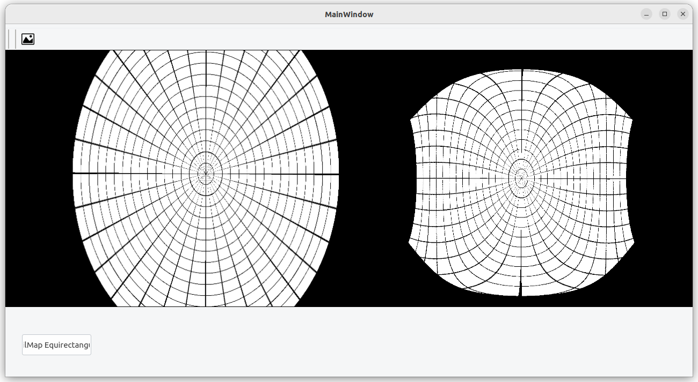
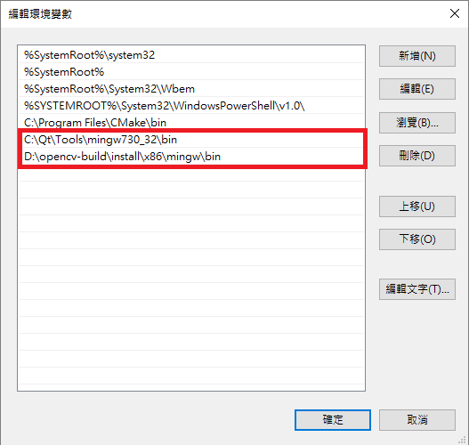
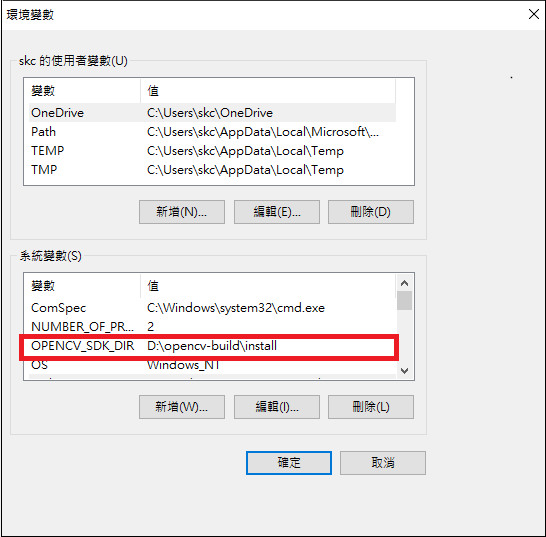

# q563_moilmap

Q563_Moilmap is a sample Qt peoject for MOIL fisheye imaging application. The target platform includes Desktop PC( Ubuntu 22.04 or Windows 11 ) and Renesas embedded RZ system.


This project intent to run a fisheye application without moildev library. The key X, Y maps for the remap functions are acquired from the network API.



## 1. Requirement 

**OpenCV** and **Qt Creator** are required. This project is mainly developed on Ubuntu 22.04/ OpenCV 4.5.4. For the compatibility with Renesas embedded platform, Installation of Qt 5.6.3 is recommanded. Please follow the steps to prepare your environments. 

Suppose we are developing our application on PC ( Ubuntu 22.04 or Windows 11 ), and the final step is to cross compile it to the target Renesas platform. We need to install the tools and kits as below,


### Ubuntu 22.04

```
sudo apt update
sudo apt upgrade
sudo apt install build-essential cmake pkg-config
sudo apt install libjpeg-dev libpng-dev libtiff-dev

sudo apt install software-properties-common
sudo add-apt-repository "deb http://security.ubuntu.com/ubuntu xenial-security main"
sudo apt update
sudo apt install libjasper1 libjasper-dev
sudo apt install libgtk-3-dev
sudo apt install libatlas-base-dev 
```

**OpenCV** :

The easy way to install OpenCV is,
``` 
sudo apt install libopencv-dev
```
It will install pre-compiled binary OpenCV 4.5.4 on Ubuntu 22.04. 

Or, you can compile OpenCV from source as below, 

```
git clone https://github.com/opencv/opencv
git clone https://github.com/opencv/opencv_contrib
cd opencv
git checkout 4.5.4
mkdir build 
cd build

cmake -D CMAKE_BUILD_TYPE=RELEASE \
-D CMAKE_INSTALL_PREFIX=/usr \
-D OPENCV_GENERATE_PKGCONFIG=ON \
-D INSTALL_PYTHON_EXAMPLES=ON \
-D INSTALL_C_EXAMPLES=ON \
-D ENABLE_CXX11=ON \
-D OPENCV_ENABLE_NONFREE=ON \
-D ENABLE_FAST_MATH=1 \
-D WITH_CUBLAS=1 \
-D OPENCV_EXTRA_MODULES_PATH=../../opencv_contrib/modules \
-D HAVE_opencv_python3=ON \
-D PYTHON_EXECUTABLE=/usr/bin/python3 \
-D WITH_GSTREAMER=ON \
-D WITH_QT=ON \
-D WITH_FFMPEG=ON \
-D WITH_GTK=ON \
-D BUILD_EXAMPLES=ON ..

make -j$(nproc)
sudo make install

```
if you have NVIDIA GPU and CUDA installed, add the parameters, for example,

```
-D WITH_CUDA=ON \
-D WITH_CUDNN=ON \
-D CUDA_FAST_MATH=1 \
-D CUDA_ARCH_BIN=8.9 \
```

**Qt 5.6.3**

Download and install Qt 5.6.3 from the below link,

https://download.qt.io/new_archive/qt/5.6/5.6.3/


### Windows 11

Reference :

How to setup Qt and openCV on Windows

https://wiki.qt.io/How_to_setup_Qt_and_openCV_on_Windows
	
You can follow the link to download and install Qt and Cmake, then recompile opencv for your development
environment by using Cmake-gui.
	
Set the environment variable OPENCV_SDK_DIR to the OpenCV build folder, This variable will be used in our Qt project.

For example,
```	
OPENCV_SDK_DIR = d:\opencv-build\install 
```	





## 2. Clone source 

```
git clone https://github.com/yourskc/qt563_moilmap.git
cd qt_moilmap
```

## 3. Build and Run

**Ubuntu 22.04**

Run the Qt Creator ( the install location may be different )

```
cd ~/Qt5.6.3/Tools/QtCreator/bin
./qtcreator
```	

Select "File/Open File or Project" in Qt menu bar, browse to q563_moilmap.pro, click "Configure Project"

Select Build/ Build the project or press Ctrl+B
The default {Build directory} of this project is like "~/build-q563_moilmap-Desktop-Debug"

Press F5 to run in Qt creator

**Renesas RZ/G2L and RZ/V2H**

Before you can select Renesas kit and cross compile as aarch64 architecture executable. Build
the Linux Yocto project with "-c populate_sdk" parameter to generate the SDK, After installation of SDK and properly configure Renesas SDK in Qt Creator, Select Projects/ Add Kit. 

Before running of Qt Creator, we need to set the environment variables.

Open a terminal window, input the commands,

```
cd /opt/poky/3.1.31
unset LD_LIBRARY_PATH
. ./environment-setup-aarch64-poky-linux

```
Run Qt Creator

```
cd ~/Qt5.6.3/Tools/QtCreator/bin
./qtcreator
```

Open the project, then Press Ctrl-B to build the project.

Please find the executable in the folder "build-q563_moilmap-RZG2L-Debug", copy the necessary files to Renesas target board for running.

```
scp ./q563_moilmap root@192.168.0.xxx:/home/root
scp -r images root@192.168.0.xxx:/home/root
```

Then boot Renesas RZ/G2L or RZ/V2H to run the executable "q563_moilmap"

**Windows 11**

```
git clone https://github.com/yourskc/qt563_moilmap.git
```

run Qt creator, select "File/ Open File or Project" in Qt menu bar, browse to q563_moilmap.pro in the above directory
	
Select Project on the left side window, click "Configure Project"

Select Build/ Build the project or press Ctrl+B

The default {Build directory} of this project is like "build-qt563_moilmap-Desktop_Qt_MinGW_32_bit-Debug"

Press F5 to run it in Qt creator
	        
 


   


	
